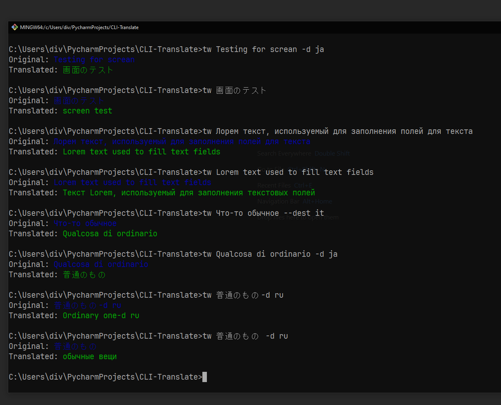
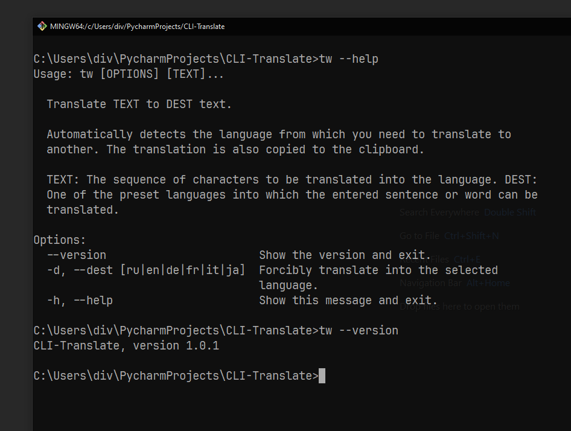

<div align="center">
  
  <h1>CLI Translate</h1>

  <p>CLI-Translate is a text translation console utility developed in Python.</p>

<!-- Badges -->
<p>
  <a href="https://github.com/Qu1nel/CLI-Translate/graphs/contributors">
    
  </a>
  <a href="https://github.com/Qu1nel/CLI-Translate/commits/main">
    
  </a>
  <a href="https://github.com/Qu1nel/CLI-Translate/network/members">
    
  </a>
  <a href="https://github.com/Qu1nel/CLI-Translate/stargazers">
    
  </a>
  <a href="https://github.com/Qu1nel/CLI-Translate/issues/">
    
  </a>
</p>

<p>
  <a href="https://www.python.org/downloads/release/python-3110/" >
    
  <a>
  <a href="https://github.com/Qu1nel/CLI-Translate/releases/">
    
  <a>
  <a href="https://github.com/Qu1nel/CLI-Translate/blob/main/LICENSE">
    
  </a>
  <a href="">
    
  </a>
  <a href="">
    
  </a>
</p>

<h4>
  <a href="#view-demo">View Demo</a>
  <span> · </span>
  <a href="#documentation">Documentation</a>
  <span> · </span>
  <a href="https://github.com/Qu1nel/CLI-Translate/issues/">Report Bug</a>
  <span> · </span>
  <a href="https://github.com/Qu1nel/CLI-Translate/issues/">Request Feature</a>
</h4>
</div>

<br />

<!-- Table of Contents -->

# Contents

- [About the Project](#about-cli-translate)
  - [Screenshots](#screenshots)
- [Installation](#installation)
  - [Requirements](#requirements)
- [Getting started](#getting-started)
  - [Windows](#windows)
  - [Linux](#linux)
- [Documentation](#documentation)
- [Flags](#flags)
- [Developers](#developers)
- [License](#license)

## About CLI Translate

CLI-Translate is a powerful multilingual text translation console utility developed in Python. This program provides a fast and reliable way to translate words, phrases, and even whole sentences into different languages.

<details>
  <summary><h3 id="screenshots">Screenshots</h3></summary>
  <div align="center">
    
    
  </div>
</details>

## Installation

Clone the repository, install all requirements and run the file `run.py`.

### Requirements

_The [`Python`](https://www.python.org/downloads/) interpreter version 3.11+ and preferably [`poetry`](https://python-poetry.org/)_

Install requirements with `poetry`:

```bash
poetry install
```

## Getting started

Clone this repository and navigate to it with the command:

```bash
git clone https://github.com/Qu1nel/CLI-Translate.git
cd CLI-Translate/
```

#### Windows

```powershell
python run.py
```

#### Linux

```bash
python3 run.py
```

## Documentation

For full help with make commands, you can use the command:

```bash
make help
```

### Flags

#### --sentence \<text\>

The original application that needs to be translated.

#### --to-lang \<lang\>

Forcibly translate into the selected language.

## Developers

- [Qu1nel](https://github.com/Qu1nel)

## License

[MIT](./LICENSE) © [Ivan Kovach](https://github.com/Qu1nel/)
